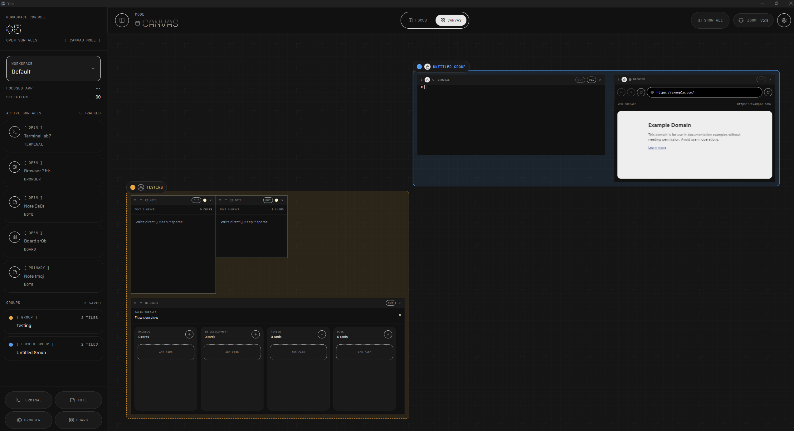

# Yira

Yira is an Electron desktop app for building terminal-centered workspaces on an infinite canvas. It combines terminals, notes, browser views, and kanban boards in a layout you can move, group, lock, and revisit later.



## Features

- Multiple workspaces
- Terminal, note, browser, and board tiles
- Canvas and Focus modes
- Tile grouping, locking, and renaming
- Settings for theme, density, grid, and browser defaults
- Persistent workspace state through Electron IPC

## Stack

- Electron
- React
- Vite
- TypeScript
- Zustand

## Project structure

- `src/main/`: Electron main process and IPC handlers
- `src/preload/`: safe renderer bridge
- `src/renderer/`: React app
- `src/shared/types.ts`: shared contracts

## Local development

Requirements:

- Node.js 22
- npm

Install dependencies:

```bash
npm ci
```

Start the app:

```bash
npm run dev
```

Type-check the project:

```bash
npx tsc --noEmit
```

From this WSL workspace, do not use `npm run build`, `npm run dist:win`, or `npm run release:win`.
