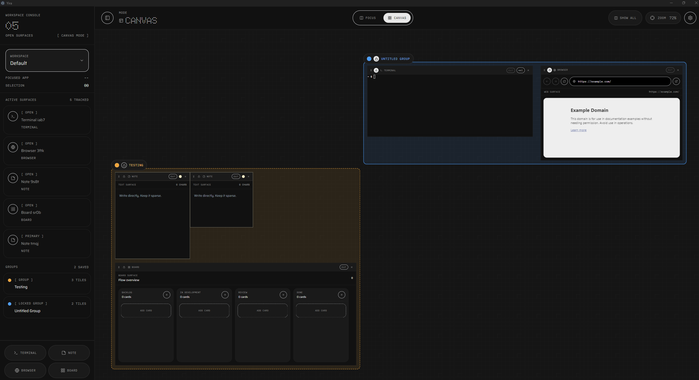

# Yira

Yira is an Electron desktop app for building terminal-centered workspaces on an infinite canvas. It combines terminals, notes, browser views, and kanban boards in a layout you can move, group, lock, and revisit later.



## Features

- Multiple workspaces
- Terminal, note, browser, and board tiles
- Canvas and Focus modes
- Tile grouping, locking, and renaming
- Settings for theme, density, grid, and browser defaults
- Persistent workspace state through Electron IPC

## Legal and support

- [Privacy Policy](docs/legal/PRIVACY.md)
- [Terms of Use and EULA](docs/legal/TERMS.md)
- [Tested platforms](docs/TESTED-PLATFORMS.md)
- [Public support and permission requests](https://github.com/SaGgaSsa/yira-releases/issues)

## Stack

- Electron
- React
- Vite
- TypeScript
- Zustand

## Project structure

- `src/main/`: Electron main process and IPC handlers
- `src/preload/`: safe renderer bridge
- `src/renderer/`: React app
- `src/shared/types.ts`: shared contracts

## Local development

Requirements:

- Node.js 22
- npm

Install dependencies:

```bash
npm ci
```

Start the app:

```bash
npm run dev
```

Development uses its own persistent data profile at `~/.yira-dev`, separate
from the real profile at `~/.yira`. The first run creates the Desarrollo,
Tareas rápidas, and Investigación example workspaces. Later runs preserve any
changes made in that development profile.

To use a different development profile location, set `YIRA_DEV_DATA_DIR`:

```bash
YIRA_DEV_DATA_DIR=/path/to/yira-dev-data npm run dev
```

Type-check the project:

```bash
npx tsc --noEmit
```

Do not use `npm run dist:win` or `npm run release:win` locally; produce Windows installers and releases in Windows CI.
